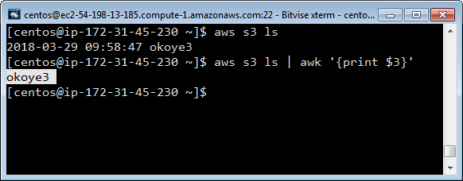
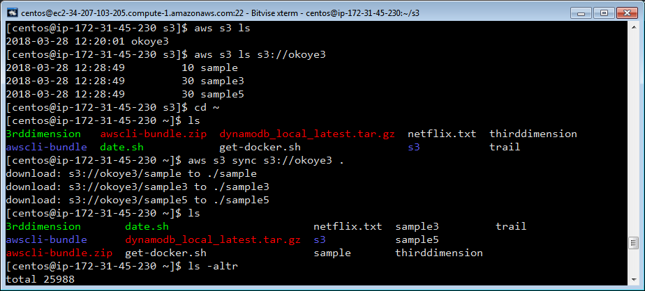

#### To view User-Data & Instance Meta-Data:    

`curl http://169.254.169.254/latest/user-data/`
 

`curl http://169.254.169.254/latest/meta-data/`

#### To see the instance region:

* ` curl http://169.254.169.254/latest/dynamic/instance-identity/document|grep region|awk -F\" '{print $4}' `                       (or)  
* `curl -s http://169.254.169.254/latest/dynamic/instance-identity/document | python -c "import json,sys; print json.loads(sys.stdin.read())['region']"`    (or)  
* `curl -s 169.254.169.254/latest/meta-data/placement/availability-zone | sed 's/.$//'`

> _All the above commands must be executed on the shell of the target instance_

#### To view ec2 instances in the desired region:        

* `aws ec2 describe-instances --region us-east-1`

#### To view S3 buckets :        
* `aws s3 ls`

#### To view contents of desired bucket in S3  :        
* `aws s3 ls s3://okoye3`

#### To sync contents of local directory to desired bucket in S3  :        
* `aws s3 sync s3://okoye3 .`

#### To sync contents of local directory to desired bucket in S3  :        
* `aws s3 sync . s3://okoye3`

#### To delete the bucket:
if bucket is empty : `aws s3 rb s3://name of the bucket`

if bucket has contents : `aws s3 rb s3://name of the bucket --force`

>For reference: [docs.aws.amazon.com](https://docs.aws.amazon.com/cli/latest/userguide/using-s3-commands.html)
