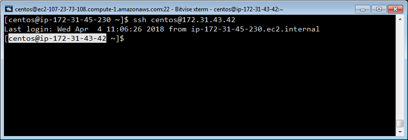
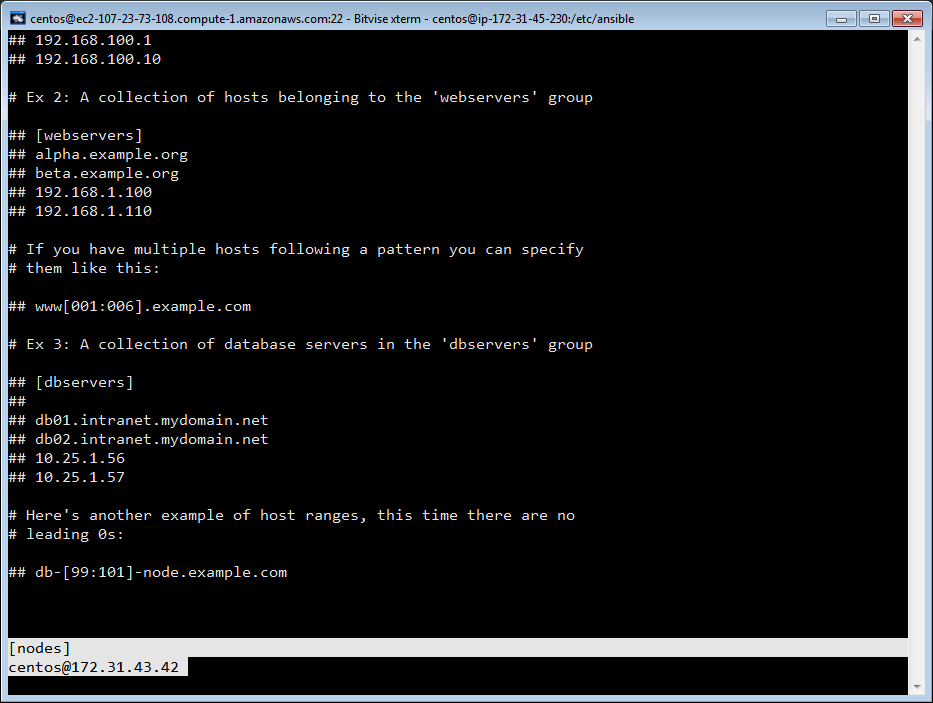
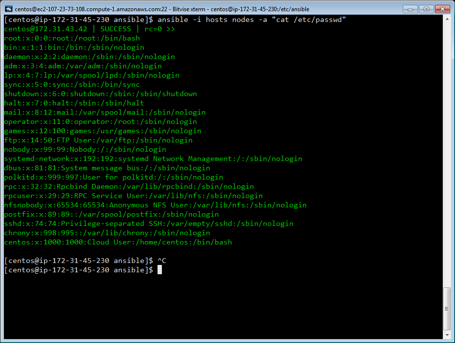

# **Installing , Configuring Ansible in EC2 instances:**

#### Installing the Ansible in Master(EC2 instance):        
* `sudo yum install ansible`

#### Configuring the node(another EC2 instance):        
* In Master generate ssh keypair using:        
*  `ssh-keygen -t rsa`        
* copy the public key of Master to ~/.ssh/authorized_keys file in node        
* `cat ~/.ssh/id_rsa.pub` (copy the output)        
* In node open the file in ~/.ssh/authorized_keys and paste the public key of Master:        
* `vi authorized_keys`

> After completing the above process we can directly ssh to the node(EC2 instance)  

#### Configuring the hosts file in Master(EC2 instance):        
* In Master go to /etc/ansible/hosts        
* `vi /etc/ansible/hosts`        
* add the group name with in "[]" (square brackets) and add the details of the node in the next line (username@ip)

 

 #### Running ansible commands from Master(EC2 instance):        
 * After completing the above onfiguration process, run a command from master to node        
 * ` ansible -i hosts nodes -a "cat /etc/passwd" `

