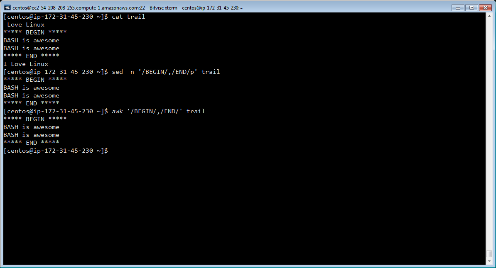

# **Shell Tips**

## **Exit status codes:**

**"Each Linux command returns a status when it terminates normally or abnormally"** which are called  **"exit status codes"**

 
 
 
## **Command to check whether a file exists:      **

* `test -f FILENAME/pathofthefile` (or)  `[ -f FILENAME/pathofthefile ]`      
**example:                      **
* `test -f /etc/passwd ; echo $?`   (or) `[ -f /etc/passwd ] ; echo $?`    
>if the output is **0** then file exists in the path(true)  
>if the output is **1** then file exists in the path(true)

* if **!** is kept after test the the ouput will be **negated**    
(`test ! -f /etc/bebebe ; echo $?` (or) `[ ! -f /etc/bebebe ] ; echo $?` )

*Test if the file exists and print a corresponding message in the each case:*

* ` [ -f "/etc/passwd" ] && echo "The file exists" || echo "The file does not exist" `

  *output:*  The file exists

* ` [ -f "/etc/bebebe" ] && echo "The file exists" || echo "The file does not exist" `  
  *output:*  The file exists

#### command to check whether a __*directory*__ exists:      

  * `test -d /etc ; echo $?` (or) `[ -d /etc ] ; echo $?`

## **Print using awk and sed:    **

*Print Lines Between Two Patterns with sed:*

* `sed -n '/StartPattern/,/EndPattern/p' FileName/pathofthefile`

*Print Lines Between Two Patterns with awk:*

* `awk '/StartPattern/,/EndPattern/' FileName/pathofthefile`

> For reference: [shellhacks.com](https://www.shellhacks.com/bash-test-if-file-exists/)
